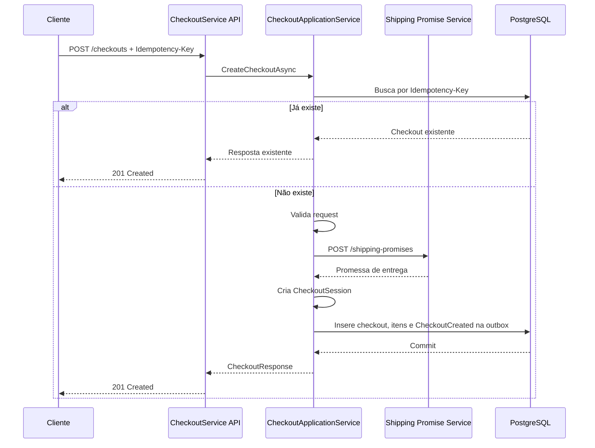
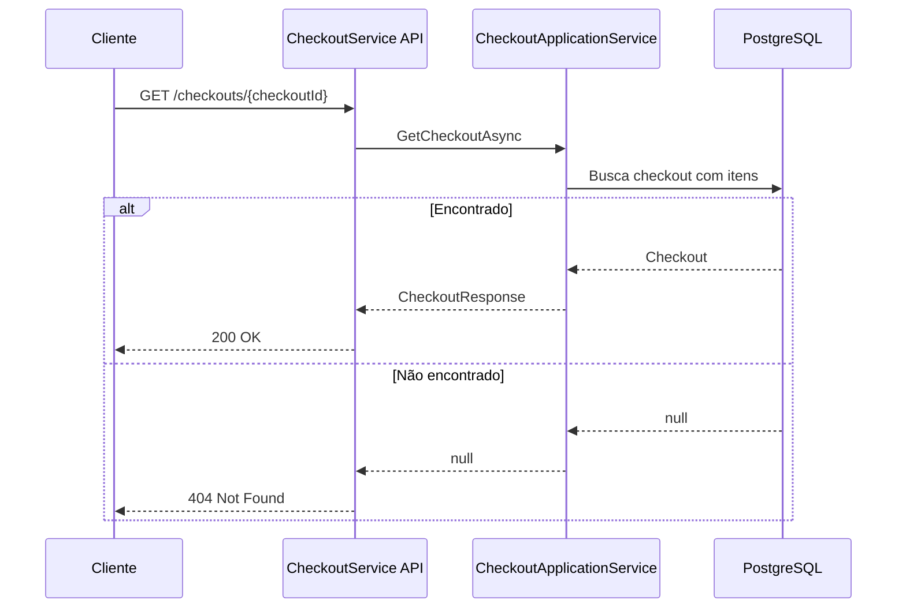
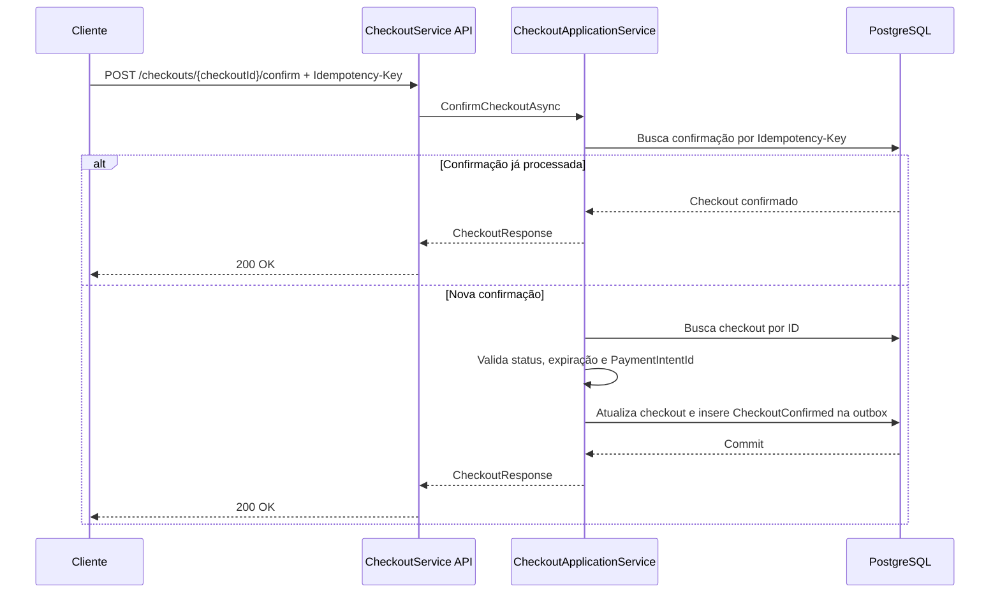

# CheckoutService

Microserviço de checkout desenvolvido em **ASP.NET Core 8 Minimal APIs** para criar, consultar e confirmar sessões de checkout de forma idempotente. O serviço atua como um orquestrador transacional leve: valida dados básicos do pedido, consulta um serviço externo de promessa de entrega, persiste a sessão no PostgreSQL via EF Core e registra eventos de integração em uma tabela de outbox.

## Sumário

- [Visão geral](#visão-geral)
- [Responsabilidades](#responsabilidades)
- [Fora do escopo](#fora-do-escopo)
- [Arquitetura e organização do projeto](#arquitetura-e-organização-do-projeto)
- [Tecnologias e dependências](#tecnologias-e-dependências)
- [Modelo de domínio](#modelo-de-domínio)
- [Fluxos principais](#fluxos-principais)
- [API HTTP](#api-http)
- [Contratos](#contratos)
- [Idempotência](#idempotência)
- [Persistência e banco de dados](#persistência-e-banco-de-dados)
- [Outbox e eventos de integração](#outbox-e-eventos-de-integração)
- [Integração com Shipping Promise Service](#integração-com-shipping-promise-service)
- [Configuração](#configuração)
- [Como executar localmente](#como-executar-localmente)
- [Health check e observabilidade](#health-check-e-observabilidade)
- [Tratamento de erros](#tratamento-de-erros)
- [Testes e qualidade](#testes-e-qualidade)
- [Evoluções recomendadas](#evoluções-recomendadas)

## Visão geral

O **CheckoutService** centraliza o ciclo inicial de um checkout:

1. Recebe comprador, vendedor, endereço de entrega e itens.
2. Valida os dados mínimos necessários para criação da sessão.
3. Consulta o **Shipping Promise Service** para obter disponibilidade, modalidade, transportadora, prazo estimado e custo do frete.
4. Cria uma sessão de checkout com validade de 15 minutos.
5. Persiste a sessão e seus itens no PostgreSQL.
6. Registra eventos de integração na outbox para publicação assíncrona.
7. Permite consultar e confirmar a sessão criada.

A aplicação expõe endpoints HTTP por Minimal APIs e usa injeção de dependência nativa do ASP.NET Core para registrar serviços de aplicação, repositórios, cliente HTTP, EF Core e health checks.

## Responsabilidades

- Criar sessões de checkout a partir de dados de carrinho.
- Validar comprador, vendedor, itens e endereço de entrega em nível básico.
- Consultar promessa de entrega e custo de frete em serviço externo.
- Calcular totais de itens, frete e valor total do checkout.
- Persistir checkouts, itens e eventos de outbox em PostgreSQL.
- Garantir idempotência na criação e na confirmação do checkout.
- Expor consulta de status e totais do checkout.
- Expor health check da aplicação e do banco de dados.

## Fora do escopo

Este microserviço **não** é responsável por:

- Cálculo de rotas, SLA ou preço de frete.
- Tracking de entrega.
- Criação de shipment ou ordem logística.
- Integração direta com transportadoras.
- Emissão de etiquetas.
- Reserva ou baixa real de estoque.
- Processamento de pagamento.
- Autenticação, autorização e validações antifraude.

## Arquitetura e organização do projeto

```text
CheckoutService/
├── Api/
│   └── CheckoutEndpoints.cs              # Endpoints HTTP do domínio de checkout
├── Application/
│   ├── CheckoutApplicationService.cs     # Casos de uso de criação, consulta e confirmação
│   ├── ICheckoutRepository.cs            # Porta de persistência de checkout
│   ├── IEventPublisher.cs                # Porta para registro/publicação de eventos
│   └── IShippingPromiseClient.cs         # Porta para integração com promessa de entrega
├── Contracts/
│   ├── CheckoutResponse.cs               # DTOs de resposta
│   ├── CreateCheckoutRequest.cs          # DTOs de entrada do checkout
│   └── ShippingPromiseContracts.cs       # DTOs da integração de frete
├── Domain/
│   ├── CheckoutItem.cs                   # Item do checkout
│   ├── CheckoutSession.cs                # Agregado principal do checkout
│   └── CheckoutStatus.cs                 # Estados possíveis do checkout
├── Infrastructure/
│   ├── CheckoutDbContext.cs              # Mapeamento EF Core
│   ├── OutboxEventPublisher.cs           # Persistência de mensagens na outbox
│   ├── OutboxMessage.cs                  # Entidade de outbox
│   ├── ShippingPromiseClient.cs          # Cliente HTTP do Shipping Promise Service
│   └── Repositories/
│       └── CheckoutRepository.cs         # Implementação EF Core do repositório
├── Program.cs                            # Bootstrap da aplicação e DI
├── appsettings.json                      # Configurações padrão
├── appsettings.Development.json          # Configurações de desenvolvimento
├── CheckoutService.csproj                # Projeto .NET
├── CheckoutService.sln                   # Solution
└── CheckoutService.http                  # Arquivo auxiliar para chamadas HTTP
```

A separação segue uma abordagem em camadas:

- **Api**: recebe requisições HTTP, extrai headers e retorna respostas HTTP.
- **Application**: implementa os casos de uso e orquestra domínio, persistência, integração externa e outbox.
- **Domain**: concentra regras e invariantes do checkout.
- **Infrastructure**: implementa detalhes técnicos, como EF Core, PostgreSQL e chamadas HTTP.
- **Contracts**: define objetos de entrada e saída usados pela API e pelas integrações.

## Tecnologias e dependências

- **.NET 8** (`net8.0`)
- **ASP.NET Core Minimal APIs**
- **Entity Framework Core**
- **Npgsql.EntityFrameworkCore.PostgreSQL**
- **Microsoft.Extensions.Diagnostics.HealthChecks.EntityFrameworkCore**
- **Swashbuckle.AspNetCore** para Swagger/OpenAPI em ambiente de desenvolvimento
- **PostgreSQL** como banco relacional

## Modelo de domínio

### CheckoutSession

Representa uma sessão de checkout. Campos principais:

| Campo | Descrição |
| --- | --- |
| `Id` | Identificador único da sessão de checkout. |
| `BuyerId` | Identificador do comprador. |
| `SellerId` | Identificador do vendedor. |
| `Status` | Estado atual da sessão. |
| `ItemsTotal` | Soma dos totais dos itens. |
| `ShippingCost` | Custo do frete retornado pelo Shipping Promise Service. |
| `TotalAmount` | Valor total do checkout: itens + frete. |
| `ShippingPromiseId` | Identificador da promessa de entrega. |
| `ShippingMode` | Modalidade de entrega. |
| `Carrier` | Transportadora. |
| `EstimatedDeliveryDate` | Data estimada de entrega. |
| `IdempotencyKey` | Chave de idempotência usada na criação. |
| `ConfirmationIdempotencyKey` | Chave de idempotência usada na confirmação. |
| `PaymentIntentId` | Identificador da intenção de pagamento informada na confirmação. |
| `CreatedAt` | Data/hora de criação em UTC. |
| `ExpiresAt` | Data/hora de expiração da sessão. |
| `ConfirmedAt` | Data/hora de confirmação, quando aplicável. |
| `Items` | Lista de itens do checkout. |

Regras relevantes:

- `BuyerId` e `SellerId` não podem ser `Guid.Empty`.
- A sessão deve ter pelo menos um item.
- A promessa de entrega é obrigatória.
- O custo de frete não pode ser negativo.
- A chave de idempotência de criação é obrigatória.
- A sessão nasce com status `Created`.
- A sessão expira 15 minutos após a criação.
- Uma sessão só pode ser confirmada se estiver em `Created` e ainda não tiver expirado.

### CheckoutItem

Representa um item do checkout.

| Campo | Descrição |
| --- | --- |
| `Id` | Identificador único do item. |
| `SkuId` | Identificador do SKU. |
| `Quantity` | Quantidade comprada. |
| `UnitPrice` | Preço unitário. |
| `Total` | Total calculado: `Quantity * UnitPrice`. |

Regras relevantes:

- `SkuId` não pode ser `Guid.Empty`.
- `Quantity` deve ser maior que zero.
- `UnitPrice` não pode ser negativo.

### Estados do checkout

| Status | Valor | Descrição |
| --- | ---: | --- |
| `Created` | 1 | Sessão criada e aguardando confirmação. |
| `Confirmed` | 2 | Sessão confirmada com uma intenção de pagamento. |
| `Expired` | 3 | Sessão expirada antes da confirmação. |
| `Cancelled` | 4 | Status reservado para cancelamento. Atualmente não há endpoint de cancelamento. |

## Fluxos principais

### 1. Criação de checkout



### 2. Consulta de checkout



### 3. Confirmação de checkout



## API HTTP

Base local padrão:

- HTTP: `http://localhost:5297`
- HTTPS: `https://localhost:7252`

Em ambiente `Development`, a documentação Swagger fica disponível em:

- `http://localhost:5297/swagger`
- `https://localhost:7252/swagger`

### POST /checkouts

Cria uma sessão de checkout.

#### Headers

| Header | Obrigatório | Descrição |
| --- | --- | --- |
| `Idempotency-Key` | Sim | Chave única fornecida pelo cliente para tornar a criação idempotente. |
| `Content-Type` | Sim | Deve ser `application/json`. |

#### Request

```json
{
  "buyerId": "11111111-1111-1111-1111-111111111111",
  "sellerId": "22222222-2222-2222-2222-222222222222",
  "shippingAddress": {
    "zipCode": "01310-100",
    "city": "São Paulo",
    "state": "SP",
    "country": "BR"
  },
  "items": [
    {
      "skuId": "33333333-3333-3333-3333-333333333333",
      "quantity": 2,
      "unitPrice": 99.90
    }
  ]
}
```

#### Resposta de sucesso

Status esperado: `201 Created`.

```json
{
  "checkoutId": "aaaaaaaa-aaaa-aaaa-aaaa-aaaaaaaaaaaa",
  "status": "Created",
  "itemsTotal": 199.80,
  "shippingCost": 18.50,
  "totalAmount": 218.30,
  "shippingOption": {
    "promiseId": "promise-123",
    "mode": "standard",
    "carrier": "Correios",
    "estimatedDeliveryDate": "2026-06-15",
    "cost": 18.50
  },
  "expiresAt": "2026-06-10T12:15:00+00:00"
}
```

#### Exemplo com curl

```bash
curl -i -X POST "http://localhost:5297/checkouts" \
  -H "Content-Type: application/json" \
  -H "Idempotency-Key: checkout-create-001" \
  -d '{
    "buyerId": "11111111-1111-1111-1111-111111111111",
    "sellerId": "22222222-2222-2222-2222-222222222222",
    "shippingAddress": {
      "zipCode": "01310-100",
      "city": "São Paulo",
      "state": "SP",
      "country": "BR"
    },
    "items": [
      {
        "skuId": "33333333-3333-3333-3333-333333333333",
        "quantity": 2,
        "unitPrice": 99.90
      }
    ]
  }'
```

### GET /checkouts/{checkoutId}

Consulta uma sessão de checkout pelo identificador.

#### Path parameters

| Parâmetro | Tipo | Obrigatório | Descrição |
| --- | --- | --- | --- |
| `checkoutId` | `guid` | Sim | Identificador da sessão de checkout. |

#### Resposta de sucesso

Status esperado: `200 OK`.

```json
{
  "checkoutId": "aaaaaaaa-aaaa-aaaa-aaaa-aaaaaaaaaaaa",
  "status": "Created",
  "itemsTotal": 199.80,
  "shippingCost": 18.50,
  "totalAmount": 218.30,
  "shippingOption": {
    "promiseId": "promise-123",
    "mode": "standard",
    "carrier": "Correios",
    "estimatedDeliveryDate": "2026-06-15",
    "cost": 18.50
  },
  "expiresAt": "2026-06-10T12:15:00+00:00"
}
```

#### Respostas alternativas

| Status | Cenário |
| --- | --- |
| `404 Not Found` | Nenhum checkout foi encontrado para o `checkoutId` informado. |

#### Exemplo com curl

```bash
curl -i "http://localhost:5297/checkouts/aaaaaaaa-aaaa-aaaa-aaaa-aaaaaaaaaaaa"
```

### POST /checkouts/{checkoutId}/confirm

Confirma uma sessão de checkout existente.

#### Headers

| Header | Obrigatório | Descrição |
| --- | --- | --- |
| `Idempotency-Key` | Sim | Chave única fornecida pelo cliente para tornar a confirmação idempotente. |
| `Content-Type` | Sim | Deve ser `application/json`. |

#### Path parameters

| Parâmetro | Tipo | Obrigatório | Descrição |
| --- | --- | --- | --- |
| `checkoutId` | `guid` | Sim | Identificador da sessão de checkout. |

#### Request

```json
{
  "paymentIntentId": "pi_123456789"
}
```

#### Resposta de sucesso

Status esperado: `200 OK`.

```json
{
  "checkoutId": "aaaaaaaa-aaaa-aaaa-aaaa-aaaaaaaaaaaa",
  "status": "Confirmed",
  "itemsTotal": 199.80,
  "shippingCost": 18.50,
  "totalAmount": 218.30,
  "shippingOption": {
    "promiseId": "promise-123",
    "mode": "standard",
    "carrier": "Correios",
    "estimatedDeliveryDate": "2026-06-15",
    "cost": 18.50
  },
  "expiresAt": "2026-06-10T12:15:00+00:00"
}
```

#### Exemplo com curl

```bash
curl -i -X POST "http://localhost:5297/checkouts/aaaaaaaa-aaaa-aaaa-aaaa-aaaaaaaaaaaa/confirm" \
  -H "Content-Type: application/json" \
  -H "Idempotency-Key: checkout-confirm-001" \
  -d '{
    "paymentIntentId": "pi_123456789"
  }'
```

### GET /health

Retorna o estado de saúde da aplicação e da conexão com o banco configurado no `CheckoutDbContext`.

#### Exemplo

```bash
curl -i "http://localhost:5297/health"
```

#### Resposta esperada

Status esperado: `200 OK` quando a aplicação e o banco estiverem saudáveis.

## Contratos

### CreateCheckoutRequest

| Campo | Tipo | Obrigatório | Regra atual |
| --- | --- | --- | --- |
| `buyerId` | `guid` | Sim | Não pode ser `Guid.Empty`. |
| `sellerId` | `guid` | Sim | Não pode ser `Guid.Empty`. |
| `shippingAddress` | `object` | Sim | Contém endereço de destino. |
| `shippingAddress.zipCode` | `string` | Sim | Não pode ser vazio. |
| `shippingAddress.city` | `string` | Sim | Sem validação específica no código atual. |
| `shippingAddress.state` | `string` | Sim | Sem validação específica no código atual. |
| `shippingAddress.country` | `string` | Sim | Sem validação específica no código atual. |
| `items` | `array` | Sim | Deve conter pelo menos um item. |
| `items[].skuId` | `guid` | Sim | Não pode ser `Guid.Empty`. |
| `items[].quantity` | `int` | Sim | Deve ser maior que zero. |
| `items[].unitPrice` | `decimal` | Sim | Não pode ser negativo. |

### ConfirmCheckoutRequest

| Campo | Tipo | Obrigatório | Regra atual |
| --- | --- | --- | --- |
| `paymentIntentId` | `string` | Sim | Não pode ser vazio. |

### CheckoutResponse

| Campo | Tipo | Descrição |
| --- | --- | --- |
| `checkoutId` | `guid` | Identificador do checkout. |
| `status` | `string` | Estado textual do checkout. |
| `itemsTotal` | `decimal` | Total dos itens. |
| `shippingCost` | `decimal` | Custo do frete. |
| `totalAmount` | `decimal` | Total final. |
| `shippingOption` | `object` | Dados da promessa de entrega selecionada. |
| `expiresAt` | `datetime-offset` | Data/hora de expiração da sessão. |

### ShippingPromiseRequest

Contrato enviado ao Shipping Promise Service:

| Campo | Tipo | Descrição |
| --- | --- | --- |
| `buyerId` | `guid` | Comprador do checkout. |
| `sellerId` | `guid` | Vendedor do checkout. |
| `destination` | `object` | Endereço de entrega. |
| `items` | `array` | Itens usados no cálculo/consulta da promessa. |

### ShippingPromiseResponse

Contrato esperado do Shipping Promise Service:

| Campo | Tipo | Descrição |
| --- | --- | --- |
| `available` | `bool` | Indica se existe entrega disponível. |
| `promiseId` | `string` | Identificador da promessa de entrega. |
| `mode` | `string` | Modalidade de entrega. |
| `carrier` | `string` | Transportadora. |
| `estimatedDeliveryDate` | `date` | Data estimada de entrega. |
| `cost` | `decimal` | Custo do frete. |
| `unavailableReason` | `string?` | Motivo de indisponibilidade, quando aplicável. |

## Idempotência

O serviço exige o header `Idempotency-Key` nos endpoints de criação e confirmação.

### Criação

- Antes de criar um checkout, o serviço busca uma sessão existente pela chave `IdempotencyKey`.
- Se encontrar, retorna a sessão já existente, evitando duplicidade.
- O banco possui índice único para `IdempotencyKey`.

### Confirmação

- Antes de confirmar, o serviço busca um checkout já confirmado pela `ConfirmationIdempotencyKey`.
- Se encontrar, retorna a confirmação existente.
- O banco possui índice único filtrado para `ConfirmationIdempotencyKey` quando o valor não é nulo.

### Recomendações de uso

- Gere uma chave única por tentativa lógica de criação de checkout.
- Reutilize a mesma chave em retentativas causadas por timeout, queda de conexão ou resposta desconhecida.
- Use uma chave diferente para a confirmação, pois ela representa outro comando de negócio.
- Não reutilize a mesma chave para checkouts diferentes.

## Persistência e banco de dados

O serviço usa EF Core com PostgreSQL. A connection string padrão está em `appsettings.json`:

```json
{
  "ConnectionStrings": {
    "CheckoutDb": "Host=localhost;Port=5432;Database=checkout;Username=checkout;Password=checkout"
  }
}
```

### Tabelas mapeadas

#### checkouts

Tabela principal da sessão de checkout.

Características importantes:

- `Status` é persistido como string com tamanho máximo de 30 caracteres.
- Campos de promessa de entrega possuem limites de tamanho.
- Valores monetários usam precisão `18,2`.
- `IdempotencyKey` possui índice único.
- `ConfirmationIdempotencyKey` possui índice único filtrado para valores não nulos.

#### checkout_items

Tabela dos itens pertencentes ao checkout.

Características importantes:

- Relação de propriedade (`OwnsMany`) com `CheckoutSession`.
- Chave estrangeira `CheckoutId`.
- `UnitPrice` com precisão `18,2`.

#### outbox_messages

Tabela de mensagens pendentes para publicação assíncrona.

Características importantes:

- `EventType` obrigatório com tamanho máximo de 200 caracteres.
- `Payload` armazenado como `jsonb`.
- Índice em `ProcessedAt` para facilitar busca de mensagens pendentes/processadas.

### Migrações

O repositório atual não contém arquivos de migração EF Core versionados. Para criar uma migração inicial, após instalar o SDK do .NET e a ferramenta do EF, execute:

```bash
dotnet tool install --global dotnet-ef
dotnet ef migrations add InitialCreate
dotnet ef database update
```

> Observação: em ambientes produtivos, prefira versionar as migrações e aplicá-las por pipeline controlado.

## Outbox e eventos de integração

O serviço implementa o padrão **Transactional Outbox**. Em vez de publicar eventos diretamente em um broker durante a transação HTTP, ele grava uma mensagem na tabela `outbox_messages` dentro da mesma unidade de trabalho do EF Core.

Eventos registrados atualmente:

| Evento | Momento | Payload principal |
| --- | --- | --- |
| `CheckoutCreated` | Após criação da sessão | `EventId`, `EventType`, `OccurredAt`, `CheckoutId`, `BuyerId`, `SellerId`, totais e dados de entrega. |
| `CheckoutConfirmed` | Após confirmação da sessão | `EventId`, `EventType`, `OccurredAt`, `CheckoutId`, `BuyerId`, `SellerId`, `TotalAmount`, dados de entrega, `PaymentIntentId` e `IdempotencyKey`. |

### Publicação dos eventos

Um worker externo deve:

1. Buscar mensagens com `ProcessedAt IS NULL`.
2. Publicar cada mensagem no broker escolhido.
3. Marcar a mensagem como processada chamando comportamento equivalente a `MarkAsProcessed`.
4. Persistir a alteração de `ProcessedAt`.

### Cuidados recomendados

- O consumidor dos eventos também deve ser idempotente.
- A publicação pode seguir semântica at-least-once.
- O `EventId` deve ser usado para deduplicação no consumidor.
- Erros de publicação devem manter a mensagem pendente para retentativa.

## Integração com Shipping Promise Service

A integração é feita por `HttpClient` tipado registrado para `IShippingPromiseClient`.

Configuração atual:

- Base URL: `Services:ShippingPromise`
- Endpoint chamado: `POST /shipping-promises`
- Timeout: `800 ms`

Exemplo de configuração:

```json
{
  "Services": {
    "ShippingPromise": "https://shipping-promise.local"
  }
}
```

Comportamento:

- Se o serviço externo retornar status HTTP não bem-sucedido, o CheckoutService registra warning e lança erro de promessa indisponível.
- Se a resposta vier vazia ou inválida, o serviço lança erro de resposta inválida.
- Se `available` for `false`, a criação do checkout é interrompida com o motivo informado em `unavailableReason`.


## Execução com dados mockados

Enquanto o banco de dados não estiver configurado, o projeto pode rodar com persistência mockada. Em `appsettings.Development.json`, `MockData:Enabled` já está como `true`, então o profile de desenvolvimento usa:

- `MockCheckoutRepository`: mantém checkouts criados em memória durante a execução da aplicação.
- `MockEventPublisher`: registra os eventos de outbox no log, sem gravar no banco quando Kafka não está configurado.
- `KafkaEventPublisher`: publica diretamente em `checkout.shipping.quote.requested` quando a seção `Kafka` está configurada.
- `InMemoryShippingPromiseProjectionRepository`: armazena em memória a projeção consumida de `shipping.promise.calculated` durante o fluxo E2E local mockado.

As chamadas HTTP para serviços externos não são mockadas nesse modo: o `ShippingPromiseClient` real permanece registrado para permitir testes de integração com o Shipping Promise Service. Configure `Services:ShippingPromise` para a URL real do serviço a ser testado.

Para voltar a usar PostgreSQL, configure `MockData:Enabled` como `false` e mantenha `ConnectionStrings:CheckoutDb` e `Services:ShippingPromise` configurados.

## Configuração

### appsettings.json

```json
{
  "Logging": {
    "LogLevel": {
      "Default": "Information",
      "Microsoft.AspNetCore": "Warning"
    }
  },
  "AllowedHosts": "*",
  "ConnectionStrings": {
    "CheckoutDb": "Host=localhost;Port=5432;Database=checkout;Username=checkout;Password=checkout"
  },
  "Services": {
    "ShippingPromise": "https://shipping-promise.local"
  }
}
```

### Variáveis de ambiente

Configurações podem ser sobrescritas por variáveis de ambiente do ASP.NET Core usando `__` para representar hierarquia:

```bash
export ConnectionStrings__CheckoutDb="Host=localhost;Port=5432;Database=checkout;Username=checkout;Password=checkout"
export Services__ShippingPromise="http://localhost:8080"
export ASPNETCORE_ENVIRONMENT="Development"
```

## Como executar localmente

### Pré-requisitos

- .NET SDK 8 ou superior.
- PostgreSQL acessível localmente ou via container.
- Um Shipping Promise Service compatível com o contrato `POST /shipping-promises`.

### 1. Subir PostgreSQL com Docker

Exemplo:

```bash
docker run --name checkout-postgres \
  -e POSTGRES_DB=checkout \
  -e POSTGRES_USER=checkout \
  -e POSTGRES_PASSWORD=checkout \
  -p 5432:5432 \
  -d postgres:16
```

### 2. Configurar dependências externas

Ajuste a URL do Shipping Promise Service:

```bash
export Services__ShippingPromise="http://localhost:8080"
```

### 3. Restaurar dependências

```bash
dotnet restore
```

### 4. Aplicar migrações

Se houver migrações versionadas:

```bash
dotnet ef database update
```

Se ainda não houver migrações, crie a migração inicial antes de aplicar:

```bash
dotnet ef migrations add InitialCreate
dotnet ef database update
```

### 5. Executar a aplicação

```bash
dotnet run --project CheckoutService.csproj
```

Ou usando o profile HTTP:

```bash
dotnet run --launch-profile http
```

### 6. Acessar Swagger

Abra:

```text
http://localhost:5297/swagger
```

## Health check e observabilidade

O endpoint `/health` usa o sistema de health checks do ASP.NET Core com verificação do `CheckoutDbContext`. Ele é útil para probes de readiness/liveness, desde que o ambiente trate corretamente a dependência com o PostgreSQL.

Logs relevantes:

- O ASP.NET Core registra logs padrão da aplicação.
- O cliente do Shipping Promise Service registra warning quando a integração externa retorna status HTTP não bem-sucedido.

Sugestões para produção:

- Adicionar correlação de logs por request.
- Propagar `traceparent`/OpenTelemetry.
- Adicionar métricas de latência por endpoint.
- Medir taxa de falhas da integração com Shipping Promise.
- Medir volume e idade das mensagens pendentes na outbox.

## Tratamento de erros

O projeto registra `AddProblemDetails()` e `UseExceptionHandler()`, permitindo que exceções não tratadas sejam convertidas pelo pipeline de erro do ASP.NET Core.

Cenários atuais:

| Cenário | Comportamento atual |
| --- | --- |
| Header `Idempotency-Key` ausente na criação | `400 Bad Request` com mensagem simples. |
| Header `Idempotency-Key` ausente na confirmação | `400 Bad Request` com mensagem simples. |
| Checkout não encontrado na consulta | `404 Not Found`. |
| Checkout não encontrado na confirmação | Exceção `InvalidOperationException`. |
| Checkout expirado na confirmação | Marca status como `Expired` e lança `InvalidOperationException`. |
| Shipping Promise indisponível | Exceção `InvalidOperationException`. |
| Shipping Promise sem opção disponível | Exceção `InvalidOperationException` com motivo. |
| Dados inválidos de domínio | `ArgumentException`. |

Evolução recomendada: mapear exceções conhecidas para respostas HTTP explícitas, por exemplo `400`, `404`, `409` e `422`, usando filtros de endpoint ou middleware dedicado.

## Testes e qualidade

O repositório atual não contém projetos de teste. Recomenda-se adicionar testes para:

- Validações de `CheckoutItem`.
- Criação de `CheckoutSession`.
- Confirmação de checkout criado.
- Rejeição de confirmação de checkout expirado.
- Idempotência de criação.
- Idempotência de confirmação.
- Mapeamento de resposta da aplicação.
- Comportamento do cliente do Shipping Promise Service em sucesso, erro HTTP e payload inválido.
- Persistência EF Core e índices únicos com PostgreSQL de teste.

Comandos úteis quando o SDK estiver disponível:

```bash
dotnet format --verify-no-changes
dotnet build
dotnet test
```

## Evoluções recomendadas

- Adicionar migrações EF Core versionadas.
- Criar projeto de testes unitários e de integração.
- Implementar worker de outbox.
- Adicionar autenticação/autorização.
- Padronizar erros com Problem Details customizado.
- Adicionar validação com FluentValidation ou filtros de endpoint.
- Adicionar OpenTelemetry para traces, métricas e logs correlacionados.
- Implementar endpoint de cancelamento, se o status `Cancelled` for utilizado.
- Adicionar política de retry/circuit breaker no cliente HTTP do Shipping Promise Service.
- Adicionar documentação OpenAPI enriquecida com exemplos e códigos de erro.
- Corrigir ou atualizar o arquivo `CheckoutService.http` para refletir os endpoints reais de checkout.

## Kafka local para teste end-to-end

O serviço usa Kafka real via `Confluent.Kafka` quando a seção `Kafka` está configurada. Para execução local fora do Docker, use o broker exposto pelo `docker-compose` do repositório de arquitetura em `localhost:9092`.

```json
{
  "Kafka": {
    "BootstrapServers": "localhost:9092",
    "ConsumerGroupId": "checkout-service",
    "Topics": {
      "ShippingQuoteRequested": "checkout.shipping.quote.requested",
      "ShippingPromiseCalculated": "shipping.promise.calculated"
    }
  }
}
```

Tópicos usados por este serviço:

| Direção | Tópico | Evento | Observação |
| --- | --- | --- | --- |
| Producer | `checkout.shipping.quote.requested` | `checkout.shipping.quote.requested` | Publicado com envelope padrão e key igual ao `checkoutId` real da sessão criada. |
| Consumer | `shipping.promise.calculated` | `shipping.promise.calculated` | Consumido de forma idempotente; `checkoutId` é obrigatório para gravar a projeção. |

> Importante: mensagens de `shipping.promise.calculated` sem `checkoutId` válido são ignoradas e registradas como erro, pois o `checkoutId` é a chave de correlação obrigatória com a sessão de checkout.

Envelope produzido em `checkout.shipping.quote.requested`:

```json
{
  "eventId": "55555555-5555-5555-5555-555555555555",
  "eventType": "checkout.shipping.quote.requested",
  "schemaVersion": "1.0",
  "occurredAt": "2026-06-14T12:00:00Z",
  "correlationId": "66666666-6666-6666-6666-666666666666",
  "producer": "checkout-service",
  "payload": {
    "checkoutId": "aaaaaaaa-aaaa-aaaa-aaaa-aaaaaaaaaaaa",
    "buyerId": "11111111-1111-1111-1111-111111111111",
    "sellerId": "22222222-2222-2222-2222-222222222222",
    "destination": {
      "zipCode": "05700-000",
      "city": "São Paulo",
      "state": "SP",
      "country": "BR"
    },
    "items": [
      {
        "skuId": "33333333-3333-3333-3333-333333333333",
        "sellerId": "22222222-2222-2222-2222-222222222222",
        "quantity": 1,
        "unitPrice": 129.9
      }
    ]
  }
}
```

Envelope esperado em `shipping.promise.calculated`:

```json
{
  "eventId": "77777777-7777-7777-7777-777777777777",
  "eventType": "shipping.promise.calculated",
  "schemaVersion": "1.0",
  "occurredAt": "2026-06-14T12:00:05Z",
  "correlationId": "66666666-6666-6666-6666-666666666666",
  "producer": "shipping-promise-service",
  "payload": {
    "checkoutId": "aaaaaaaa-aaaa-aaaa-aaaa-aaaaaaaaaaaa",
    "buyerId": "11111111-1111-1111-1111-111111111111",
    "sellerId": "22222222-2222-2222-2222-222222222222",
    "promiseId": "promise_123",
    "mode": "same_day",
    "carrier": "carrier_1",
    "estimatedDeliveryDate": "2026-06-15",
    "cost": 14.9,
    "currency": "BRL",
    "source": "calculated"
  }
}
```

A UI do Kafka fica em <http://localhost:8088>. Ela deve ser usada apenas para inspeção; o broker configurado nos serviços é `localhost:9092`.

### Como executar localmente com Kafka

1. Suba a infraestrutura local pelo repositório `meli-envios-architecture`.
2. Confirme que o Kafka está exposto em `localhost:9092` e abra a UI em <http://localhost:8088>.
3. Restaure, compile e teste o serviço:

```bash
dotnet restore
dotnet build
dotnet test
```

4. Execute o serviço:

```bash
dotnet run
```

5. Crie um checkout informando `Idempotency-Key` e, opcionalmente, `X-Correlation-Id`. O serviço propaga o correlation id no envelope Kafka padrão.

### Como validar no Kafka UI

1. Acesse <http://localhost:8088>.
2. Abra o tópico `checkout.shipping.quote.requested`.
3. Crie um checkout e verifique uma mensagem com envelope contendo `eventId`, `eventType`, `schemaVersion`, `occurredAt`, `correlationId`, `producer` e `payload`.
4. Publique uma mensagem canônica em `shipping.promise.calculated` com key igual ao `checkoutId` para validar o consumer.
5. Verifique nos logs do serviço as entradas com `topic`, `message key`, `eventType` e `correlationId`.

### Limitações e próximos passos

- O modo mock continua disponível para desenvolvimento; quando a seção `Kafka` está configurada, ele usa producer Kafka real e também registra o consumer de `shipping.promise.calculated` com projeção em memória.
- Em modo com banco configurado, eventos de cotação são gravados no outbox e despachados em background para evitar derrubar indevidamente o request HTTP em falhas temporárias de Kafka.
- O consumer de `shipping.promise.calculated` registra projeções idempotentes por `eventId` ou por `correlationId` + `checkoutId`.
